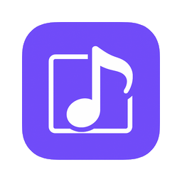

# MediaOverlay

 

## A universal overlay for all mediaplayers that broadcast via MediaSession or NotificationListener.

This is again an app created 80% with AI and 20% "me, myself and I". 
It is a universal overlay for all media players that support the standaard Android MediaSession format. It does not support FYT/Dudu music and FYT/DuDu radio as those are probably the only players in the world that do not support this world standard. 
**Note:** This is an overlay, not a widget. A widget can be put on the home screen, but any app that you start will show on top of the widget, thereby making it no longer visible. An overlay will always "float" on top over any other app. 
This overlay can be dragged to any position on the screen. 
Why this app? DuDu has a widget which supports all mediaplayers that support the MediaSession format. Vasyl91 made the excellent ["Display Media Titles for FYT"](https://xdaforums.com/t/display-media-titles-for-fyt.4692979/). 
So, why this app? I created this app because it is possible and it is slightly different from Vasyl91's "text-only" media titles, and I really don't like the lyrics possibility from the Dudu widget..

**This app does not collect, store or share any personal information. It is 100% privacy friendly.**

## Required permissions
 - Overlay permission - Draw over other apps.
 - Notification permission - Get media metadata but also use prev/next/play/pause buttons from overlay. On setting the Notifications permission, you can get the popup that it is not allowed to change a "Restricited setting". To bypass this, go to android settings > Apps > MediaOverlay, tap the three-dot menu, and select "Allow restricted settings" to enable access.

## Small video
This is a 50% reduced video from my Samsung S22 Ultra. Why from my phone? Because any Android 10+ device should have built-in screen recorder, but the FYTs/DUDu's don't have it. Any screen recorder I now tested on the DuDu is terrible. 
So I used the built-in screen recorder on my Samsung.
[Media Overlay](https://drive.google.com/file/d/1EQa45SmrPkXC7YfW3xHbgchR9Pb3nRE6/view?usp=sharing)

## Installation
Just download the apk from [Github](https://github.com/hvdwolf/MediaOverlay/releases/latest) and then side-load the application from your file manager. (Note: When Google asks you to scan the app, then do so. My app is signed and should be absolutely safe and secure, but we live in dangerous times). 

## Settings screen
The settings that might need explanation:
- polling interval - the number in seconds it checks for new metadata (default: 10 seconds)
- transpararency overlay - You can make it from totally solid (100% opaque) to totally (100%) transparent.

## Releases
The releases are done via [my github](https://github.com/hvdwolf/MediaOverlay/releases/latest). 
The app should run on \*any\* Android device from minimally Android 6 (SDK 23) to Android 16, but I only tested on my DuDu7 running Android 13/SDK33 (and on my Samsung S22 Ultra running Android 16). 

## Translations
I used MS CoPilot to do an automatic translation of the strings. The default language is (US) English. Other abbreviated languages are (so far): us, de, fr, nl, pl, pt, ro, ru, uk, zh-rCN (simplified Chinese). 
If you want to have it in your own language, you need to download the [strings.xml](https://github.com/hvdwolf/SpeedAlert/raw/main/app/src/main/res/values/strings.xml), and translate it (note the multi-line disclaimer and the dialog_fyt_message) and send it back to me. A good advice might be to select and copy the entire text and tell chatgpt, ms copilot, gemini or whatever AI tool to "translate the following strings.xml to *my language*"  and then copy the text behind it. It saves you a lot of typing. Only some correcting if necessary. 
If you think your language is badly translated, download the strings.xml from your country folder [values-xx](https://github.com/hvdwolf/SpeedAlert/raw/main/app/src/main/res/) and improve the translation, and in case of unclear translations, also download the US English version to compare.

Copyleft 2026 Harry van der Wolf (surfer63), MIT License. 

## MIT License
Permission is hereby granted, free of charge, to any person obtaining a copy
of this software and associated documentation files (the "Software"), to deal
in the Software without restriction, including without limitation the rights
to use, copy, modify, merge, publish, distribute, sublicense, and/or sell
copies of the Software, and to permit persons to whom the Software is
furnished to do so, subject to the following conditions:

The above copyright notice and this permission notice shall be included in all
copies or substantial portions of the Software.

THE SOFTWARE IS PROVIDED "AS IS", WITHOUT WARRANTY OF ANY KIND, EXPRESS OR
IMPLIED, INCLUDING BUT NOT LIMITED TO THE WARRANTIES OF MERCHANTABILITY,
FITNESS FOR A PARTICULAR PURPOSE AND NONINFRINGEMENT. IN NO EVENT SHALL THE
AUTHORS OR COPYRIGHT HOLDERS BE LIABLE FOR ANY CLAIM, DAMAGES OR OTHER
LIABILITY, WHETHER IN AN ACTION OF CONTRACT, TORT OR OTHERWISE, ARISING FROM,
OUT OF OR IN CONNECTION WITH THE SOFTWARE OR THE USE OR OTHER DEALINGS IN THE
SOFTWARE.